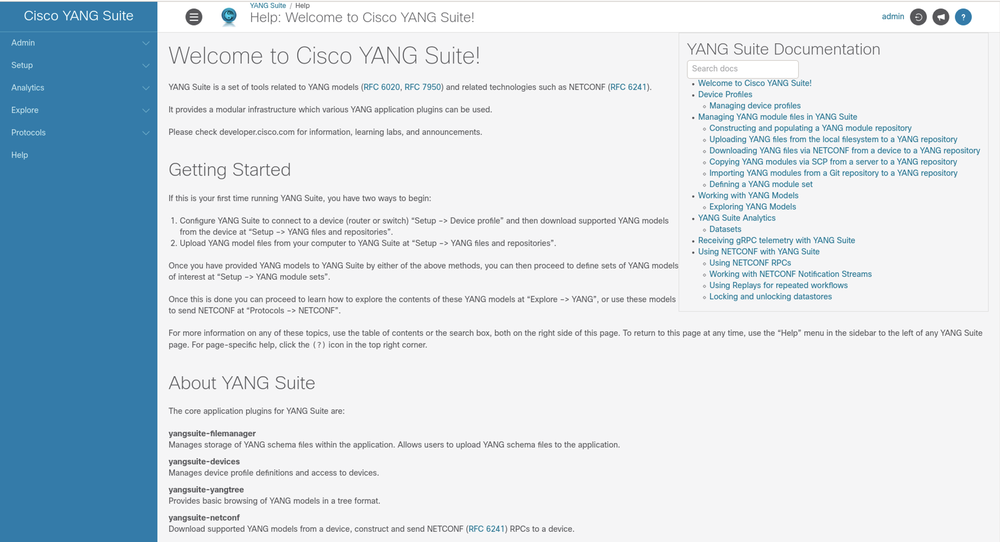
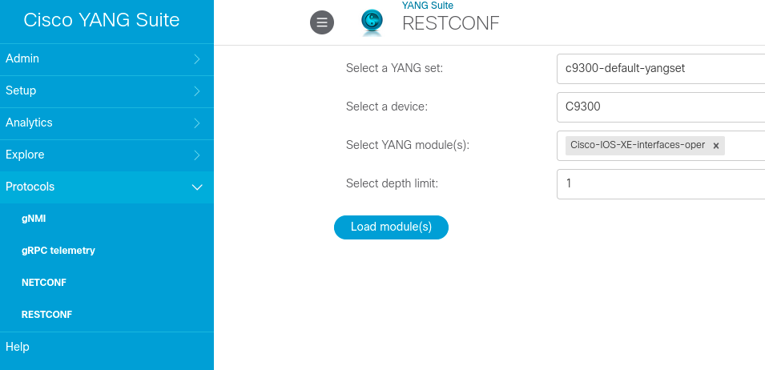
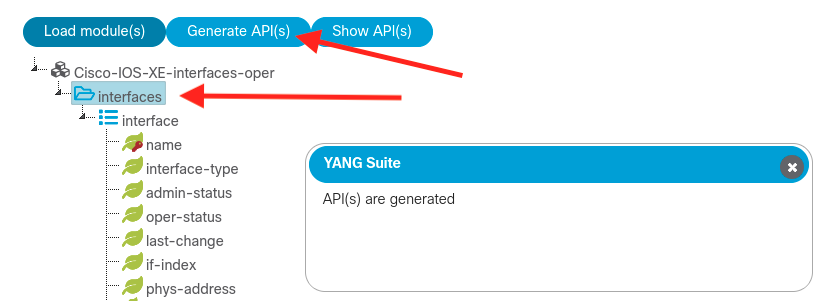
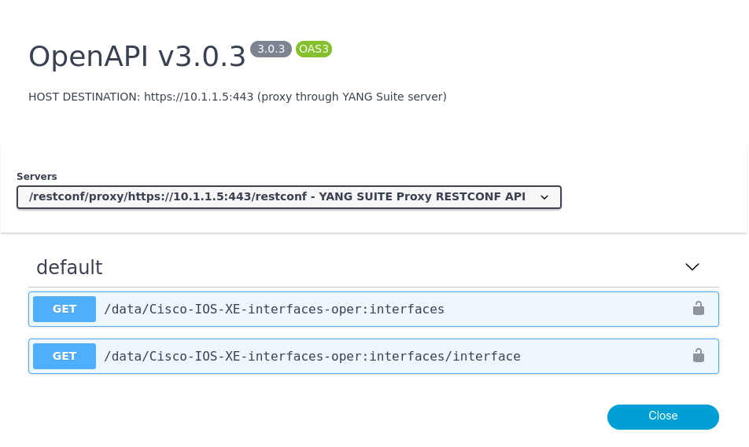
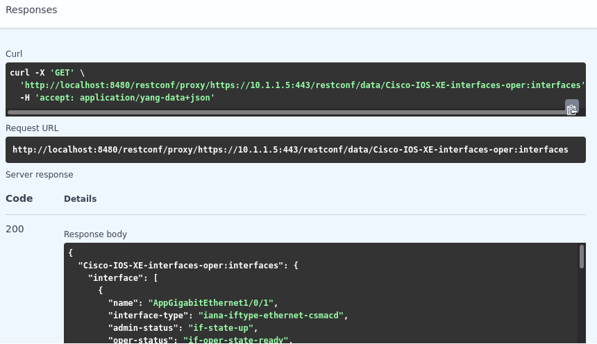
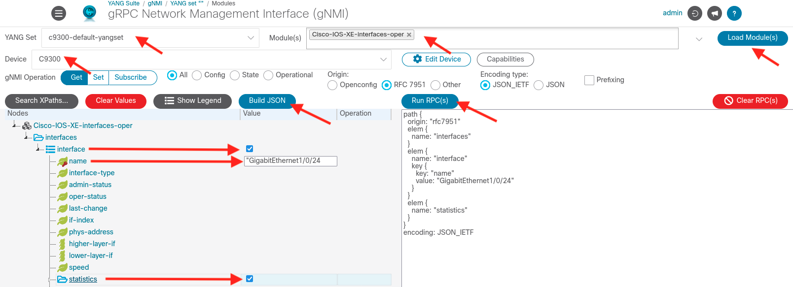
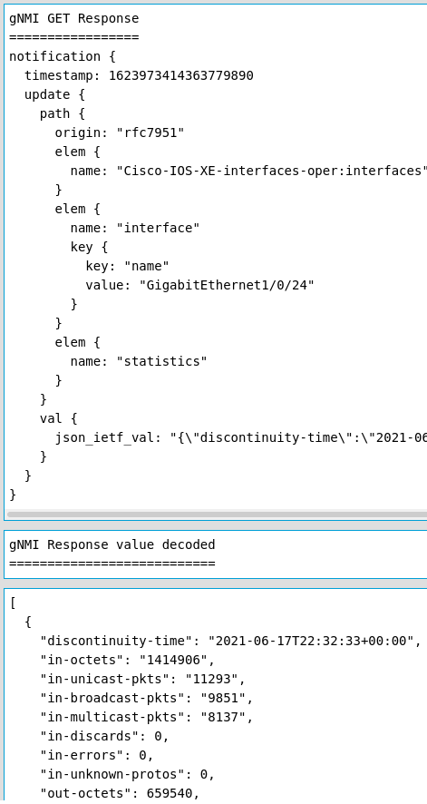
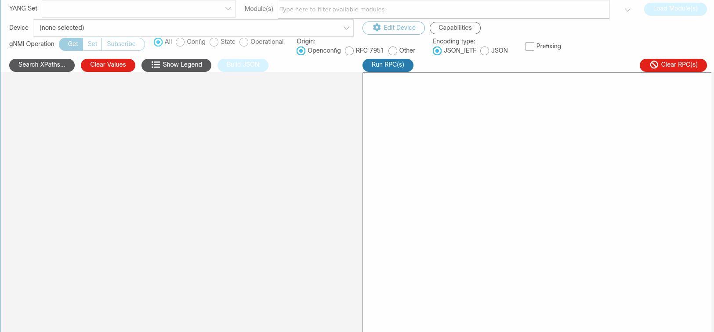

## [IOS XE Programmability Lab](https://github.com/jeremycohoe/cisco-ios-xe-programmability-lab)

# YANG Suite 

YANG Suite was publicly released onto Github and the landing page is found within DevNet at https://github.com/CiscoDevNet/yangsuite

YANG Suite provides a YANG API testing and validation envrionment that supports NETCONF, RESTCONF, gNMI, and gRPC Telemetry. This tool has been covered in previous SEVT and Cisco Live events, and now that it is publicly and freely available the focus is on the 2 newly release plugins which are **RESTCONF and gNMI** 

## Module Topics:

Getting Started

RESTCONF

gNMI


## Getting Started

Access the POD# that you have been assigned to using Remote Desktop, then open the Firefox web browser and access YANG Suite at **http://localhost** 

Login using the provided credentials **(admin/superuser)**

Once logged in, you'll end up at the main YANG Suite application window

YANG Suite has been pre-configured with the C9300 device, the data modules repo and set, as described in the previous YANG Suite lab. Continue to use the RESTCONF or gNMI plugins next.



## RESTCONF

Access the RESTCONF plugin by selecting **Protocols > RESTCONF** from the left navigation pane

Select the YANG set: c9300-default-yangset

Select the device: C9300

Select the YANG module: Cisco-IOS-XE-interfaces-oper

Set the depth limit: 1

Select **Load module(s)** once the above fields are correctly set, it should be similar to the screenshot below:



Once the module is loaded, select the **interfaces** container then select "**Generate API(s)**, then select **Show APIs** button



Once selecting the **Show APIs** button the OpenAPI view will be seen



Select the first **GET** and then **Execute**, and the RESTCONF API call will be sent to the device, which will reply with the interface operational data as requested



The API call that is used in the above example is proxied through the local YANG Suite instance, and the CURL and URI is shown below for reference. This can easily be taken into other orchistration tools or systems to retrive this data as needed. The same is true for configuration use cases.

```
curl -X 'GET' \
  'http://localhost:8480/restconf/proxy/https://10.1.1.5:443/restconf/data/Cisco-IOS-XE-interfaces-oper:interfaces' \
  -H 'accept: application/yang-data+json'

http://localhost:8480/restconf/proxy/https://10.1.1.5:443/restconf/data/Cisco-IOS-XE-interfaces-oper:interfaces
```

The output from the RESTCONF API call will look similar to the below output:

```
{
  "Cisco-IOS-XE-interfaces-oper:interfaces": {
    "interface": [
      {
        "name": "GigabitEthernet1/0/24",
        "interface-type": "iana-iftype-ethernet-csmacd",
        "admin-status": "if-state-up",
        "oper-status": "if-oper-state-ready",
        "last-change": "2021-06-17T22:34:43.015+00:00",
        "if-index": 32,
        "phys-address": "a0:f8:49:15:5b:c0",
        "speed": "1000000000",
        "statistics": {
          "discontinuity-time": "2021-06-17T22:32:33+00:00",
          "in-octets": "868995",
          "in-unicast-pkts": "7216",
          "in-broadcast-pkts": "6277",
          "in-multicast-pkts": "5187",
          "in-discards": 0,
          "in-errors": 0,
          "in-unknown-protos": 0,
          "out-octets": 417320,
          "out-unicast-pkts": "1376",
          "out-broadcast-pkts": "11",
          "out-multicast-pkts": "0",
          "out-discards": "0",
          "out-errors": "0",
          "rx-pps": "3",
          "rx-kbps": "3",
          "tx-pps": "1",
          "tx-kbps": "1",
          "num-flaps": "0",
          "in-crc-errors": "0",
          "in-discards-64": "0",
          "in-errors-64": "0",
          "in-unknown-protos-64": "0",
          "out-octets-64": "417320"
```

This is a brief introduction to the RESTCONF module - feel free to explore other YANG data models and operations supported by this API interface and the tooling plugin.


## gNMI

Access the gNMI plugin by selecting **Protocols > gNMI** from the left navigation pane

The view and workflow is very similar to the NETCONF plugin that was explored in previous labs. 

Select the YANG Set: c9300-default-yangset

Select the Module: Cisco-IOS-XE-interfaces.oper, then select **Load Modules**

Select Device: C9300

Select Origin: RFC7951

In the "Nodes" section, expand the YANG data model "Cisco-IOS-XE-interfaces-oper" and **click** on the **value** volume where the row is the **interface list** as shown below. For the key name, use the interface **GigabitEthernet1/0/24** and also select the **statistics** container by again clicking in the value column.



The payload that is generated when selecting the **Build JSON** button should look identical to below:

```
path {
  origin: "rfc7951"
  elem {
    name: "interfaces"
  }
  elem {
    name: "interface"
    key {
      key: "name"
      value: "GigabitEthernet1/0/24"
    }
  }
  elem {
    name: "statistics"
  }
}
encoding: JSON_IETF
```

Once this JSON payload has been generated by YANG Suite's gNMI plugin, it is ready to be executed, by selecting the **Run RPC** button.

The gNMI GET, gNMI GET Response, and gNMI Responce value decoded is shown below:



The raw values should look similar to the below outputs

**gNMI GET**
```
gNMI GET
========
path {
  origin: "rfc7951"
  elem {
    name: "interfaces"
  }
  elem {
    name: "interface"
    key {
      key: "name"
      value: "GigabitEthernet1/0/24"
    }
  }
  elem {
    name: "statistics"
  }
}
encoding: JSON_IETF
```

**gNMI GET Response**
```
gNMI GET Response
=================
notification {
  timestamp: 1623973414363779890
  update {
    path {
      origin: "rfc7951"
      elem {
        name: "Cisco-IOS-XE-interfaces-oper:interfaces"
      }
      elem {
        name: "interface"
        key {
          key: "name"
          value: "GigabitEthernet1/0/24"
        }
      }
      elem {
        name: "statistics"
      }
    }
    val {
      json_ietf_val: "{\"discontinuity-time\":\"2021-06-17T22:32:33+00:00\",\"in-octets\":\"1414906\",\"in-unicast-pkts\":\"11293\",\"in-broadcast-pkts\":\"9851\",\"in-multicast-pkts\":\"8137\",\"in-discards\":0,\"in-errors\":0,\"in-unknown-protos\":0,\"out-octets\":659540,\"out-unicast-pkts\":\"2057\",\"out-broadcast-pkts\":\"11\",\"out-multicast-pkts\":\"0\",\"out-discards\":\"0\",\"out-errors\":\"0\",\"rx-pps\":\"2\",\"rx-kbps\":\"3\",\"tx-pps\":\"0\",\"tx-kbps\":\"0\",\"num-flaps\":\"0\",\"in-crc-errors\":\"0\",\"in-discards-64\":\"0\",\"in-errors-64\":\"0\",\"in-unknown-protos-64\":\"0\",\"out-octets-64\":\"659540\"}"
    }
  }
}
```

**gNMI Response value decoded**
```
gNMI Response value decoded
===========================

[
  {
    "discontinuity-time": "2021-06-17T22:32:33+00:00",
    "in-octets": "1414906",
    "in-unicast-pkts": "11293",
    "in-broadcast-pkts": "9851",
    "in-multicast-pkts": "8137",
    "in-discards": 0,
    "in-errors": 0,
    "in-unknown-protos": 0,
    "out-octets": 659540,
    "out-unicast-pkts": "2057",
    "out-broadcast-pkts": "11",
    "out-multicast-pkts": "0",
    "out-discards": "0",
    "out-errors": "0",
    "rx-pps": "2",
    "rx-kbps": "3",
    "tx-pps": "0",
    "tx-kbps": "0",
    "num-flaps": "0",
    "in-crc-errors": "0",
    "in-discards-64": "0",
    "in-errors-64": "0",
    "in-unknown-protos-64": "0",
    "out-octets-64": "659540"
  }
]
```

The completed workflow should look similar to the following



This is another very basic example of using the YANG Suite gNMI plugin to retreive operational information from the IOS XE device

## Conclusion

In this module the new capabilities of the **YANG Suite** tooling was used to explore the RESTCONF and gNMI programmatic interfaces within IOS XE

Please mark this module complete in the following SmartSheet form and be sure to include your name, e-mail ID, and pod #

https://app.smartsheet.com/b/form/134240eac2d84a57acd4efc24fd8f3d0