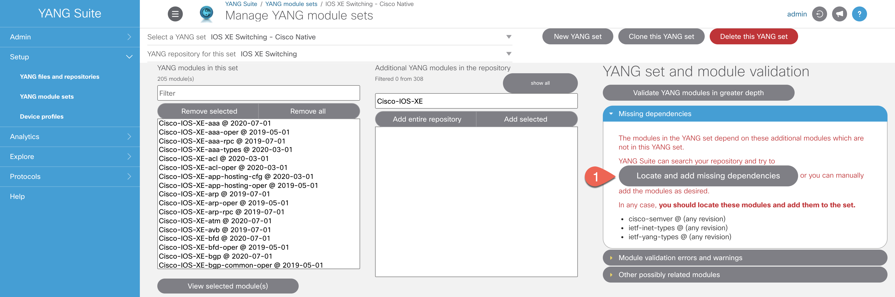

# YANG Suite core Django application.

Capable of dynamic discovery of installed application plugins. Provides common library APIs for logging, filesystem access, GUI appearance and behavior, and client-server communication.

Authors: Members of the Cisco YANG Suite development team.
Supports: Python 3.6, Python 3.7, Python 3.8
YANG Suite can be installed as a Docker container or through Python package management. Docker-compose is the recommended install.

Requires about 3.5GB of memory to load large Cisco native models.

Refer to this page for the YANG Suite installation guidance https://github.com/CiscoDevNet/yangsuite

Background

IOS XE Release: 17.3


## Module Topics:

Introduction to NETCONF/YANG

Enable NETCONF/YANG

YANGSuite

Conclusion


## Introduction to NETCONF/YANG

In this section we will look at YANG data models, why we need them, and how to find them. We will use a tool called YangSuite to find the data models we need, and we will write Python scripts using the models.

## Login Information

Enable NETCONF/YANG

Before we start using YANG Suite to look at the data models on our switches, we need to run through a few steps to enable NETCONF, which is not on by default.

Open a SSH session to your C9300 switch and Verify AAA and NETCONF are already configured on the device.

```
C9300#sh run | sec aaa

aaa new-model

aaa authentication login default local

aaa authorization exec default local

aaa session-id common

C9300#sh run | sec vty  

line vty 0 4  

exec-timeout 0 0

 length 0  

transport input all

line vty 5 15  

exec-timeout 0 0  

length 0  

transport input all

C9300#sh run | i netconf

netconf-yang

C9300#show run | i username

username admin privilege 15 secret 9 ....

```

# YANGSuite

YANG Suite is a tool developed by Cisco to help you visualize YANG data models downloaded from a device, to test sending and receiving data to/from devices using YANG models, as well as a NETCONF RPC Builder Application to experiment with YANG Data Models.

At the beginning of this lab we already have verified AAA and NETCONF on the switch that have been already configured on the device.

> Access the POD# that you have been assigned to.

* Open a Firefox web browser and access YANG Suite at **localhost**

* Login using the provided credentials **(admin/C1sc0dna)**

Once logged in, you'll end up at the mail YANG Suite application window:

>PLACEHOLDER FOR THE IMAGE

YANG Suite allows you to work with different YANG Modules repositories. This is very useful especially if working with different device releases at the same time.

### Configure YANG Suite to connect to a device

>Configure the device profile in Cisco YANG Suite

Navigate to **Setup -> Device Profiles** and click on **Create new device**


In the pop up window type in the following information as shown below

```
Profile Name: C9300

Address:

Username:

Password:
```


*Note: Make sure to select **"Device support NETCONF"** and **"Skip SSH key validation for this device"** since the device doesn't have a consistent SSH key.*


Click on **Create Profile** when finished

>PLACEHOLDER FOR THE IMAGE

Once you have entered the information, you can click the **"Check Connectivity"** button.

>PLACEHOLDER FOR THE IMAGE

### Download YANG models from the device

> Create a new YANG module Repository

From the menu at the left side of the page select **"Setup"** > **"YANG files and repositories"**.

* Click on **"New repository"**.

* Enter the new repository name **"IOS XE Switching"**.

* Click on **"Create repository"**.


The newly created repository is automatically selected from the **"Select a YANG module repository"**

We are going to download the whole schema list from the device to our newly added repository.

* Navigate to the **"NETCONF"** tab

* Select device profile from the drop-down **“C9300”**.
* Click on **"Get schema list"** > **"Select all"** > **"Download selected schemas"**.


>Create a YANG module Set

Next, you will create a YANG model set. A YANG set is a subset of a YANG repository, consisting of a set of modules of interest and any necessary dependencies they have. A YANG set could be as large as the entire repository's contents, but it's often more efficient to narrow the set down to only the models that we're really interested in.

From the menu at the left side of the page select **"Setup"** > **"YANG module sets"**

* Click on **"New YANG set"**.

* Type in name for new YANG set **“IOS XE Switching – Cisco Native”**.
* Click on **"Create YANG set"**.


Now we will add YANG Modules to the newly created set.

* In the box on the right, filter for **“Cisco-IOS-XE”** native modules.

* Select all modules from the right box.
* Click on **"Add selected"**


After you add selected YANG modules to the **IOS XE Switching-Cisco Native** set, click on **"Locate and add missing dependencies"** in the Missing dependencies box on the right side.




YANG Suite automatically runs a validation check to make sure all the modules dependencies are met and provides an automatic remediation in case some dependencies are missing.
All the IOS XE Native modes are displayed in the box on the left.


### Explore YANG Models

Now that we have a YANG model repository and have identified a YANG model subset of interest, let's explore the data model. From the menu at the left side of the page, select **"Explore" > "YANG"**.

* Select **"IOS XE Switching – Cisco Native"** from the Select a YANG set drop down menu.

* Type **“interface”** in the **"Select YANG modules(s)"** box and select the **“Cisco-IOS-XE-interfaces-oper“** module.
* Click on the **"Load module(s)"** button and expand the **“Cisco-IOS-XE-interfaces-oper”** module by clicking on the triangle on the left.

After a moment, the left column will be populated with a tree view of the contents of this module. Initially the tree view shows only the module itself, but you can click the triangle icon next to it to expand the tree. Go ahead and expand various parts of the tree


